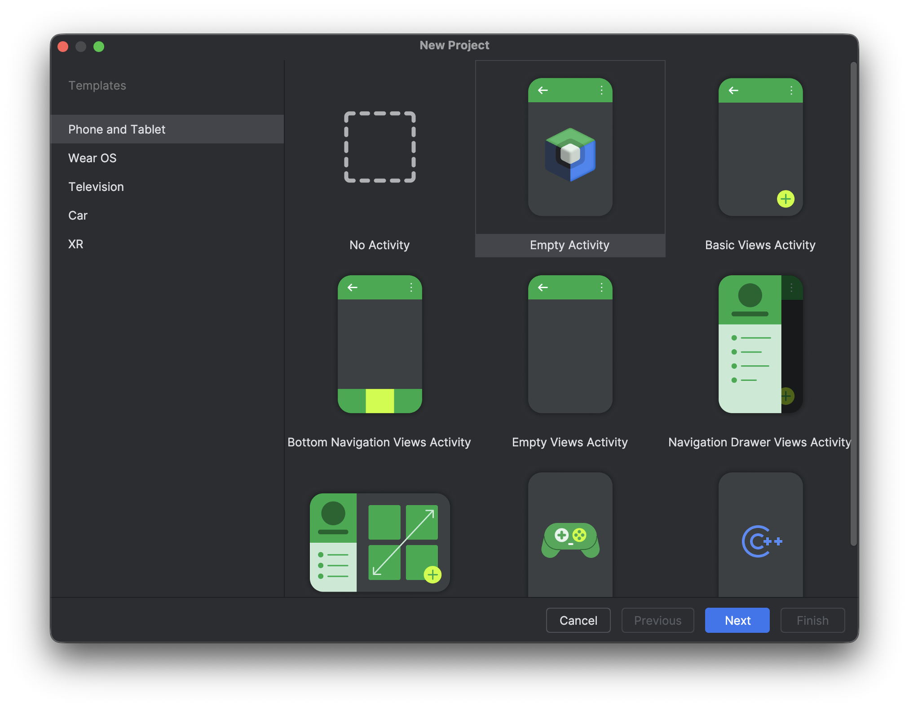
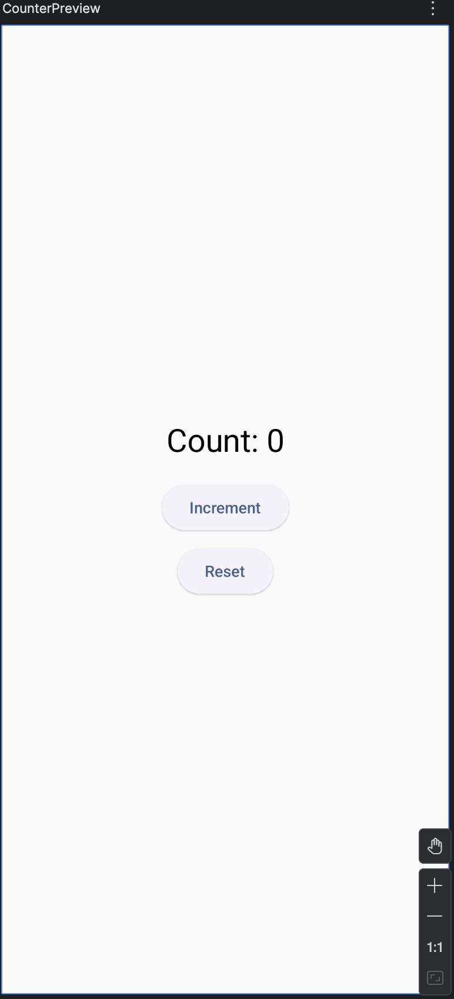

# Simple Jetpack Compose App

In this lab, we will build two simple composable to better understand how Jetpack Compose works. We will create a Counter composable to understand state management and a Profile Card composable to learn layout and UI composition.

## Create a New Compose Project

- Create a new Project and choose `Empty Activity`



## The Counter Composable

Now let's create a counter that increments when we click a button. For simplicity, we will add this composable function to your MainActivity.kt

```Kotlin
@Composable
fun Counter() {

    // Here we keep track of the counter value
    var count by remember { mutableStateOf(0) }
    
    Column(
        horizontalAlignment = Alignment.CenterHorizontally,
        verticalArrangement = Arrangement.Center,
        modifier = Modifier.fillMaxSize()
    ) {
        Text(
            text = "Count: $count",
            style = MaterialTheme.typography.headlineMedium
        )
        
        ElevatedButton(
            onClick = { count++ },
            modifier = Modifier.padding(top = 16.dp)
        ) {
            Text("Increment")
        }
        
        ElevatedButton(
            onClick = { count = 0 },
            modifier = Modifier.padding(top = 8.dp)
        ) {
            Text("Reset")
        }
    }
}
```

Once we are done with the composable, we can create a preview to check how does it look like.

```kotlin
@Preview(showBackground = true)
@Composable
fun CounterPreview() {
    SimpleComposeAppTheme {
        Counter()
    }
}
```

<p align="center">

</p>

## Update The MainActivity
Now we can update the MainActivity to use the Counter composable

```kotlin
class MainActivity : ComponentActivity() {
    override fun onCreate(savedInstanceState: Bundle?) {
        super.onCreate(savedInstanceState)
        enableEdgeToEdge()
        setContent {
            SimpleComposeAppTheme {
                Surface(
                    modifier = Modifier.fillMaxSize(),
                    color = MaterialTheme.colorScheme.background
                ) {
                    Counter()
                }
            }
        }
    }
}
```

## Adding the Profile Card Composable

Profile Card can be used to show a user profile or details. This is an important component that can be used in different scenarios and locations in a typical application.

```kotlin
@Composable
fun ProfileCard() {
    var isExpanded by remember { mutableStateOf(false) }

    Surface(
        color = MaterialTheme.colorScheme.surface,
        shadowElevation = 4.dp,
        shape = MaterialTheme.shapes.medium,
        modifier = Modifier
            .padding(16.dp)
            .clickable { isExpanded = !isExpanded }
    ) {
        Column(
            modifier = Modifier.padding(16.dp)
        ) {
            Row(verticalAlignment = Alignment.CenterVertically) {
                // Profile image
                Image(
                    painter = painterResource(R.drawable.anna),
                    contentDescription = "Profile picture",
                    contentScale = ContentScale.Crop,
                    modifier = Modifier
                        .size(74.dp)
                        .clip(CircleShape)
                        .border(2.dp, MaterialTheme.colorScheme.primary, CircleShape)
                )

                Spacer(modifier = Modifier.width(16.dp))

                // Profile info
                Column {
                    Text(
                        text = "Anna Mary",
                        style = MaterialTheme.typography.headlineSmall,
                        color = MaterialTheme.colorScheme.onPrimaryContainer
                    )
                    Text(
                        text = "Android Developer",
                        style = MaterialTheme.typography.bodyMedium,
                        color = MaterialTheme.colorScheme.onPrimaryContainer.copy(alpha = 0.7f)
                    )
                }
            }

            // Expandable section
            if (isExpanded) {
                Text(
                    text = "Passionate about building  Android apps.",
                    modifier = Modifier.padding(top = 16.dp),
                    style = MaterialTheme.typography.bodyMedium
                )
            }
        }
    }
}
```

Then we can add the Preview

```kotlin
@Preview
@Composable
fun ProfileCardPreview(){
    SimpleComposeAppTheme {
        ProfileCard()
    }
}
```

## Main Screen

Now, we can create the screen to host both composables.

```kotlin
@Composable
fun MainScreen() {
    Column(
        horizontalAlignment = Alignment.CenterHorizontally,
        modifier = Modifier
            .fillMaxSize()
            .padding(16.dp)
    ) {
        Text(
            "Profile App",
            style = MaterialTheme.typography.headlineLarge,
            modifier = Modifier.padding(bottom = 24.dp)
        )

        ProfileCard()

        Text(
            "Counter",
            style = MaterialTheme.typography.headlineSmall,
            modifier = Modifier.padding(vertical = 24.dp)
        )

        Counter()
    }
}
```

And Preview

```kotlin
@Preview(showBackground = true)
@Composable
fun MainScreenPreview(){
    SimpleComposeAppTheme {
        MainScreen()
    }
}
```

## Update the MainActivity

Once we are done, we can update the MainActivity to show the new screen.

```kotlin
 setContent {
            SimpleComposeAppTheme {
                Surface(
                    modifier = Modifier.fillMaxSize(),
                    color = MaterialTheme.colorScheme.background
                ) {
                    MainScreen()
                }
            }
        }
```