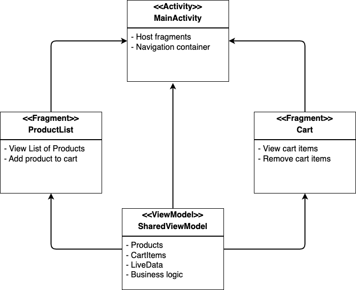

# Shopping Cart App 

This example focuses on demonstrating fragments and fragments communication using Shared ViewModel.

### App Description
A simple shopping cart application that demonstrates how fragments are using the host container and how they can communicate with each other using a Shared ViewModel. The app consists of:

- **Product List Fragment**: Displays available products and allows adding them to cart
- **Cart Fragment**: Shows selected products, allows removal, and displays total price
- **Shared ViewModel**: Manages the app's data and business logic, enabling communication between fragments


### Architecture Diagram



---

## Implementation Steps

## Step 1: Project Dependencies

To be able to use the navigation component and the viewmodel both for the activity and the fragments include these dependencies.
**`app/build.gradle.kts`**:
```kotlin
dependencies {

    implementation("androidx.activity:activity-ktx:1.11.0")
    implementation("androidx.lifecycle:lifecycle-viewmodel-ktx:2.9.4")
    implementation("androidx.fragment:fragment-ktx:1.8.9")
    implementation("androidx.navigation:navigation-ui-ktx:2.9.5")
    implementation("androidx.navigation:navigation-fragment-ktx:2.9.5")

```

- `fragment-ktx`: Provides Kotlin extensions for fragments, including the `by activityViewModels()` delegate
- `lifecycle-viewmodel-ktx`: ViewModel support with Kotlin extensions
- `lifecycle-livedata-ktx`: LiveData support for reactive programming

---

## Step 2: Data Models

### Product Data Class

The ``Product`` data class automatically generates useful methods like `equals()`, `hashCode()`, and `toString()`


**`models/Product.kt`**:
```kotlin
package my.edu.nottingham.shoppingcart.model

data class Product(
    val id: Int,
    val name: String,
    val price: Double,
    val imageRes: Int = android.R.drawable.ic_menu_report_image
)
```

---

## Step 3: Shared ViewModel Implementation

The viewModel provides the main communication mean between the two fragments as well as it manages when the navigation should take place.

### CartViewModel Class

**`viewmodel/CartViewModel.kt`**:
```kotlin
package my.edu.nottingham.shoppingcart.viewmodel

import androidx.lifecycle.LiveData
import androidx.lifecycle.MutableLiveData
import androidx.lifecycle.ViewModel
import my.edu.nottingham.shoppingcart.model.Product
import kotlin.collections.filter

class SharedViewModel : ViewModel() {

    // LiveData for product list
    private val _products = MutableLiveData<List<Product>>()
    val products: LiveData<List<Product>> get() = _products

    // LiveData for cart items
    private val _cartItems = MutableLiveData<List<Product>>()
    val cartItems: LiveData<List<Product>> get() = _cartItems

    // LiveData for navigation
    private val _navigateToCart = MutableLiveData<Boolean>()
    val navigateToCart: LiveData<Boolean> get() = _navigateToCart

    init {
        // Fake data to initialise the list
        _products.value = listOf(
            Product(1, "Laptop", 999.99),
            Product(2, "Smartphone", 699.99),
            Product(3, "Headphones", 149.99),
            Product(4, "Tablet", 399.99),
            Product(5, "Smartwatch", 199.99)
        )
        _cartItems.value = emptyList()
    }

    // Add product to cart
    fun addToCart(product: Product) {
        val currentCart = _cartItems.value ?: emptyList()
        _cartItems.value = currentCart + product
    }

    // Remove product from cart
    fun removeFromCart(product: Product) {
        val currentCart = _cartItems.value ?: emptyList()
        _cartItems.value = currentCart.filter { it.id != product.id }
    }

    // Get total cart price
    fun getTotalPrice(): Double {
        return _cartItems.value?.sumOf { it.price } ?: 0.0
    }

    // Get cart items count
    fun getCartItemCount(): Int {
        return _cartItems.value?.size ?: 0
    }

    // Navigate to cart
    fun navigateToCart() {
        _navigateToCart.value = true
    }

    // Reset navigation
    fun onNavigationComplete() {
        _navigateToCart.value = false
    }
}
```

**LiveData vs MutableLiveData**
- `MutableLiveData`: Internal, mutable version that ViewModel can modify
- `LiveData`: Public, immutable version that fragments can only observe


---

## Step 4: User Interface Layouts

The Product list fragment uses a simple Linearlayout and it is composed of a header section ``Our products``, the cart navigation button that shows the current cart count and allows navigation to cart, then a ``ScrollView`` to show all the products

### Product List Fragment Layout

**`res/layout/fragment_products.xml`**:
```xml
<?xml version="1.0" encoding="utf-8"?>
<LinearLayout xmlns:android="http://schemas.android.com/apk/res/android"
    android:layout_width="match_parent"
    android:layout_height="match_parent"
    android:orientation="vertical"
    android:padding="16dp">

    <TextView
        android:layout_width="match_parent"
        android:layout_height="wrap_content"
        android:text="Our Products"
        android:textSize="24sp"
        android:textStyle="bold"
        android:gravity="center"
        android:layout_marginBottom="24dp" />

    <Button
        android:id="@+id/btnGoToCart"
        android:layout_width="wrap_content"
        android:layout_height="wrap_content"
        android:text="View Cart (0)"
        android:layout_gravity="end"
        android:layout_marginBottom="24dp" />

    <ScrollView
        android:layout_width="match_parent"
        android:layout_height="0dp"
        android:layout_weight="1">

        <LinearLayout
            android:id="@+id/layoutProducts"
            android:layout_width="match_parent"
            android:layout_height="wrap_content"
            android:orientation="vertical" />

    </ScrollView>

</LinearLayout>
```

### Cart Fragment Layout

The cart fragment presents the list of items added to the cart and the total price. It also provides the possibility go back to the list of products.

**`res/layout/fragment_cart.xml`**:
```xml
<?xml version="1.0" encoding="utf-8"?>
<LinearLayout xmlns:android="http://schemas.android.com/apk/res/android"
    android:layout_width="match_parent"
    android:layout_height="match_parent"
    android:orientation="vertical"
    android:padding="16dp">

    <TextView
        android:layout_width="match_parent"
        android:layout_height="wrap_content"
        android:text="Shopping Cart"
        android:textSize="24sp"
        android:textStyle="bold"
        android:gravity="center"
        android:layout_marginBottom="24dp" />

    <TextView
        android:id="@+id/tvEmpty"
        android:layout_width="match_parent"
        android:layout_height="wrap_content"
        android:text="Your cart is empty"
        android:textSize="18sp"
        android:gravity="center"
        android:visibility="visible" />

    <ScrollView
        android:layout_width="match_parent"
        android:layout_height="0dp"
        android:layout_weight="1">

        <LinearLayout
            android:id="@+id/layoutCartItems"
            android:layout_width="match_parent"
            android:layout_height="wrap_content"
            android:orientation="vertical"
            android:visibility="gone" />

    </ScrollView>

    <LinearLayout
        android:layout_width="match_parent"
        android:layout_height="wrap_content"
        android:orientation="horizontal"
        android:gravity="center_vertical"
        android:layout_marginTop="16dp">

        <TextView
            android:layout_width="0dp"
            android:layout_height="wrap_content"
            android:layout_weight="1"
            android:text="Total:"
            android:textSize="18sp"
            android:textStyle="bold" />

        <TextView
            android:id="@+id/tvTotal"
            android:layout_width="wrap_content"
            android:layout_height="wrap_content"
            android:text="$0.00"
            android:textSize="18sp"
            android:textStyle="bold" />

    </LinearLayout>

    <Button
        android:id="@+id/btnBack"
        android:layout_width="match_parent"
        android:layout_height="wrap_content"
        android:text="Continue Shopping"
        android:layout_marginTop="16dp" />

    <Button
        android:id="@+id/btnClear"
        android:layout_width="match_parent"
        android:layout_height="wrap_content"
        android:text="Clear Cart"
        android:layout_marginTop="8dp" />

</LinearLayout>
```

### Product Item Layout

**`res/layout/item_product.xml`**:
```xml
<?xml version="1.0" encoding="utf-8"?>
<LinearLayout xmlns:android="http://schemas.android.com/apk/res/android"
    android:layout_width="match_parent"
    android:layout_height="wrap_content"
    android:orientation="horizontal"
    android:padding="16dp"
    android:layout_margin="8dp"
    android:background="?android:attr/selectableItemBackground">


    <LinearLayout
        android:layout_width="0dp"
        android:layout_height="wrap_content"
        android:layout_weight="1"
        android:orientation="vertical">

        <TextView
            android:id="@+id/tvProductName"
            android:layout_width="match_parent"
            android:layout_height="wrap_content"
            android:text="Product Name"
            android:textSize="16sp"
            android:textStyle="bold" />

        <TextView
            android:id="@+id/tvProductPrice"
            android:layout_width="match_parent"
            android:layout_height="wrap_content"
            android:text="$0.00"
            android:textSize="14sp"
            android:textColor="?android:attr/textColorSecondary" />

    </LinearLayout>

    <Button
        android:id="@+id/btnAddToCart"
        android:layout_width="wrap_content"
        android:layout_height="wrap_content"
        android:text="Add to Cart" />

</LinearLayout>
```

### Cart Item Layout

**`res/layout/item_cart.xml`**:
```xml
<?xml version="1.0" encoding="utf-8"?>
<LinearLayout xmlns:android="http://schemas.android.com/apk/res/android"
    android:layout_width="match_parent"
    android:layout_height="wrap_content"
    android:orientation="horizontal"
    android:padding="16dp"
    android:layout_margin="8dp"
    android:background="?android:attr/selectableItemBackground">

    <!-- Product Information -->
    <LinearLayout
        android:layout_width="0dp"
        android:layout_height="wrap_content"
        android:layout_weight="1"
        android:orientation="vertical">

        <TextView
            android:id="@+id/tvProductName"
            android:layout_width="match_parent"
            android:layout_height="wrap_content"
            android:text="Product Name"
            android:textSize="16sp"
            android:textStyle="bold" />

        <TextView
            android:id="@+id/tvProductPrice"
            android:layout_width="match_parent"
            android:layout_height="wrap_content"
            android:text="$0.00"
            android:textSize="14sp"
            android:textColor="?android:attr/textColorSecondary" />

    </LinearLayout>

    <Button
        android:id="@+id/btnRemove"
        android:layout_width="wrap_content"
        android:layout_height="wrap_content"
        android:text="Remove" />

</LinearLayout>
```

---

## Step 5: Fragment Implementations

### Products Fragment

**`fragments/ProductListFragment.kt`**:
```kotlin
class ProductListFragment : Fragment() {

    // Get the shared ViewModel using activityViewModels
    private val sharedViewModel: SharedViewModel by activityViewModels()

    private lateinit var listViewProducts: ListView
    private lateinit var btnViewCart: Button


    override fun onCreateView(
        inflater: LayoutInflater, container: ViewGroup?,
        savedInstanceState: Bundle?
    ): View? {
        
        return inflater.inflate(R.layout.fragment_product_list, container, false)
    }

    override fun onViewCreated(view: View, savedInstanceState: Bundle?) {
        super.onViewCreated(view, savedInstanceState)

        // Initialize views
        listViewProducts = view.findViewById(R.id.listViewProducts)
        btnViewCart = view.findViewById(R.id.btnViewCart)

        setupObservers()
        setupProductList()
        setupClickListeners()
    }

    private fun setupObservers() {
        // Observe cart item count to update the button text
        sharedViewModel.cartItems.observe(viewLifecycleOwner, Observer { cartItems ->
            btnViewCart.text = "View Cart (${cartItems.size})"
        })

        // Observe navigation events
        sharedViewModel.navigateToCart.observe(viewLifecycleOwner, Observer { shouldNavigate ->
            if (shouldNavigate) {
                findNavController().navigate(R.id.action_productListFragment_to_cartFragment)
                sharedViewModel.onNavigationComplete()
            }
        })
    }

    private fun setupProductList() {
        // Create a custom adapter for the product list
        val adapter = object : ArrayAdapter<Product>(
            requireContext(),
            R.layout.item_product,
            R.id.tvProductName
        ) {
            override fun getView(position: Int, convertView: View?, parent: ViewGroup): View {
                val view = convertView ?: LayoutInflater.from(context)
                    .inflate(R.layout.item_product, parent, false)

                val product = getItem(position)!!
                val tvProductName = view.findViewById<android.widget.TextView>(R.id.tvProductName)
                val tvProductPrice = view.findViewById<android.widget.TextView>(R.id.tvProductPrice)
                val btnAddToCart = view.findViewById<Button>(R.id.btnAddToCart)

                tvProductName.text = product.name
                tvProductPrice.text = "$${product.price}"

                btnAddToCart.setOnClickListener {
                    sharedViewModel.addToCart(product)
                }

                return view
            }
        }
        // Set the adapter and populate with products
        sharedViewModel.products.observe(viewLifecycleOwner, Observer { products ->
            adapter.clear()
            adapter.addAll(products)
        })

        listViewProducts.adapter = adapter
    }

    private fun setupClickListeners() {
        btnViewCart.setOnClickListener {
            sharedViewModel.navigateToCart()
        }
    }

}
```

### Cart Fragment

**`fragments/CartFragment.kt`**:
```kotlin
class CartFragment : Fragment() {

    // Get the same shared ViewModel instance
    private val sharedViewModel: SharedViewModel by activityViewModels()

    private lateinit var listViewCart: ListView
    private lateinit var tvEmptyCart: TextView
    private lateinit var tvTotalPrice: TextView
    private lateinit var btnBackToProducts: Button


    override fun onCreateView(
        inflater: LayoutInflater, container: ViewGroup?,
        savedInstanceState: Bundle?
    ): View? {
        // Inflate the layout for this fragment
        return inflater.inflate(R.layout.fragment_cart, container, false)
    }

    override fun onViewCreated(view: View, savedInstanceState: Bundle?) {
        super.onViewCreated(view, savedInstanceState)

        // Initialize views
        listViewCart = view.findViewById(R.id.listViewCart)
        tvEmptyCart = view.findViewById(R.id.tvEmptyCart)
        tvTotalPrice = view.findViewById(R.id.tvTotalPrice)
        btnBackToProducts = view.findViewById(R.id.btnBackToProducts)

        setupObservers()
        setupCartList()
        setupClickListeners()
    }

    private fun setupObservers() {
        // Observe cart items and update UI
        sharedViewModel.cartItems.observe(viewLifecycleOwner, Observer { cartItems ->
            updateCartUI(cartItems)
        })

        // Observe total price
        sharedViewModel.cartItems.observe(viewLifecycleOwner, Observer {
            tvTotalPrice.text = "$${sharedViewModel.getTotalPrice()}"
        })
    }

    private fun setupCartList() {
        val adapter = object : ArrayAdapter<Product>(
            requireContext(),
            R.layout.item_cart,
            R.id.tvProductName
        ) {
            override fun getView(position: Int, convertView: View?, parent: ViewGroup): View {
                val view = convertView ?: LayoutInflater.from(context)
                    .inflate(R.layout.item_cart, parent, false)

                val product = getItem(position)!!
                val tvProductName = view.findViewById<android.widget.TextView>(R.id.tvProductName)
                val tvProductPrice = view.findViewById<android.widget.TextView>(R.id.tvProductPrice)
                val btnRemoveFromCart = view.findViewById<Button>(R.id.btnRemoveFromCart)

                tvProductName.text = product.name
                tvProductPrice.text = "$${product.price}"

                btnRemoveFromCart.setOnClickListener {
                    sharedViewModel.removeFromCart(product)
                }

                return view
            }
        }
        // Set the adapter and observe cart items
        sharedViewModel.cartItems.observe(viewLifecycleOwner, Observer { cartItems ->
            adapter.clear()
            adapter.addAll(cartItems)
        })

        listViewCart.adapter = adapter
    }

    private fun updateCartUI(cartItems: List<Product>) {
        if (cartItems.isEmpty()) {
            tvEmptyCart.visibility = View.VISIBLE
            listViewCart.visibility = View.GONE
        } else {
            tvEmptyCart.visibility = View.GONE
            listViewCart.visibility = View.VISIBLE
        }
    }

    private fun setupClickListeners() {
        btnBackToProducts.setOnClickListener {
            findNavController().navigateUp()
        }
    }

}
```

---

## Step 6: Main Activity and Navigation

### Main Activity

**`MainActivity.kt`**:
```kotlin
class MainActivity : AppCompatActivity() {
    override fun onCreate(savedInstanceState: Bundle?) {
        super.onCreate(savedInstanceState)
        enableEdgeToEdge()
        setContentView(R.layout.activity_main)

        setSupportActionBar(findViewById(R.id.toolbar))
        val navHostFragment = supportFragmentManager
            .findFragmentById(R.id.nav_host_fragment) as NavHostFragment
        val navController = navHostFragment.navController

        // Setup action bar with navigation
        val appBarConfiguration = AppBarConfiguration(navController.graph)
        setupActionBarWithNavController(navController, appBarConfiguration)
    }

    override fun onSupportNavigateUp(): Boolean {
        val navHostFragment = supportFragmentManager
            .findFragmentById(R.id.nav_host_fragment) as NavHostFragment
        return navHostFragment.navController.navigateUp() || super.onSupportNavigateUp()
    }
}
```

### Activity Layout

**`res/layout/activity_main.xml`**:
```xml
<LinearLayout xmlns:android="http://schemas.android.com/apk/res/android"
    xmlns:app="http://schemas.android.com/apk/res-auto"
    xmlns:tools="http://schemas.android.com/tools"
    android:id="@+id/main"
    android:layout_width="match_parent"
    android:layout_height="match_parent"
    android:orientation="vertical"
    tools:context=".MainActivity">

   <com.google.android.material.appbar.AppBarLayout
       android:layout_width="match_parent"
       android:layout_height="wrap_content" >

      <androidx.appcompat.widget.Toolbar
          android:id="@+id/toolbar"
          android:layout_width="match_parent"
          android:layout_height="?attr/actionBarSize"
          android:background="?attr/colorPrimary"
          app:titleTextColor="@android:color/white" />
   </com.google.android.material.appbar.AppBarLayout>

   <androidx.fragment.app.FragmentContainerView
       android:id="@+id/nav_host_fragment"
       android:name="androidx.navigation.fragment.NavHostFragment"
       android:layout_width="match_parent"
       android:layout_height="match_parent"
       app:defaultNavHost="true"
       app:navGraph="@navigation/nav_graph">


   </androidx.fragment.app.FragmentContainerView>

</LinearLayout>
```
